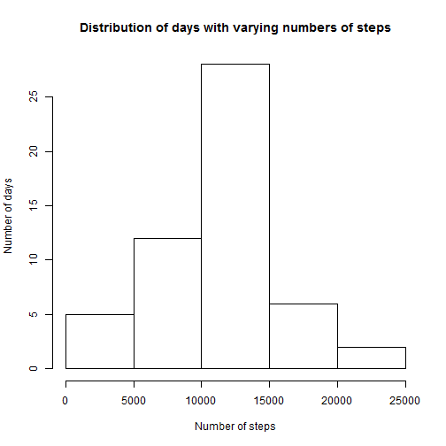
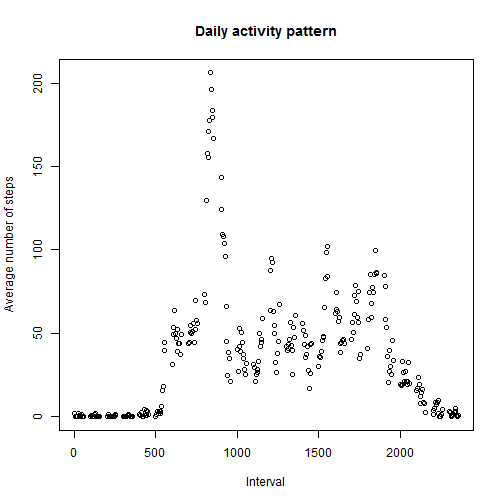
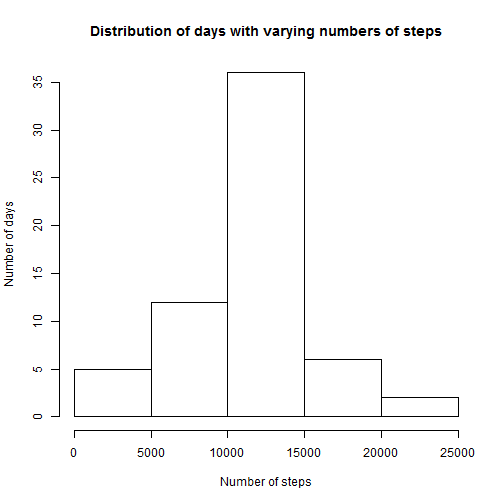
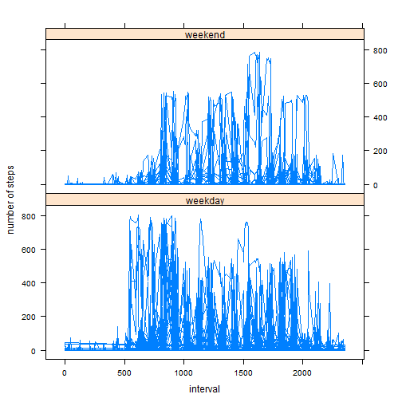

# Reproducible Research: Peer Assessment 1
========================================================

## Loading and preprocessing the data
 
*Show any code that is needed to load the data (i.e. read.csv())*
*and process/transform the data (if necessary) into a format suitable*
*for your analysis.*


```r
data = read.csv("activity.csv")
```

## What is mean total number of steps taken per day?

*For this part of the assignment, you can ignore the missing values in* 
*the dataset.*

*Make a histogram of the total number of steps taken each day.* 


```r
library(data.table)

d <- data[complete.cases(data),]
dt <- data.table(d)
byDate <- dt[,sum(steps),by=date]
setnames(byDate, "V1", "steps")
hist(byDate$steps, xlab="Number of steps", ylab="Number of days", 
     main="Distribution of days with varying numbers of steps")
```

 

*Calculate and report the mean and median total number of steps taken per day*


```r
mean(byDate$steps)
```

```
## [1] 10766
```

```r
median(byDate$steps)
```

```
## [1] 10765
```
The mean and median can be seen above.

## What is the average daily activity pattern?

*Make a time series plot*
*(i.e. type = "l") of the 5-minute interval (x-axis)*
*and the average number of steps taken, averaged across all days (y-axis)*


```r
byInterval <- dt[,mean(steps),by=interval]
setnames(byInterval, "V1", "meanSteps")
plot(byInterval$interval, byInterval$meanSteps, 
     xlab="Interval", ylab="Average number of steps",
     main="Daily activity pattern")
```

 

*Which 5-minute interval, on average across all the days in the dataset,*
*contains the maximum number of steps?*


```r
index <- which(byInterval$meanSteps == max(byInterval$meanSteps))
byInterval$interval[index]
```

```
## [1] 835
```

The answer is interval 835.

## Imputing missing values

*Note that there are a number of days/intervals where there are missing values*
*(coded as NA). The presence of missing* 
*days may introduce bias into some calculations or summaries of the data.*
*Calculate and report the total number of missing values in the dataset* 
*(i.e. the total number of rows with NAs)*


```r
sum(!complete.cases(data))
```

```
## [1] 2304
```

There are 2304 missing values.

*Devise a strategy for filling in all of the missing values in the dataset.* 
*The strategy does not need to be sophisticated. For example, you could use the*
*mean/median for that day, or the mean for that 5-minute interval, etc.*
*Create a new dataset that is equal to the original dataset but with the*
*missing data filled in.*

Here I use the mean for that 5-minute interval:


```r
dataImputed <- data
for (i in seq(data$steps))
{
    if (is.na(data$steps[i]))
    {
        dataImputed$steps[i] <- 
            byInterval$meanSteps[which(byInterval$interval == data$interval[i])]
    }
}
```

*Make a histogram of the total number of steps taken each day and calculate and*
*report the mean and median total number of steps taken per day. Do these*
*values differ from the estimates from the first part of the assignment? What*
*is the impact of imputing missing data on the estimates of the total daily*
*number of steps?*


```r
byDate <- data.table(dataImputed)[,sum(steps),by=date]
setnames(byDate, "V1", "steps")
hist(byDate$steps, xlab="Number of steps", ylab="Number of days", 
     main="Distribution of days with varying numbers of steps")
```

 

```r
mean(byDate$steps)
```

```
## [1] 10766
```

```r
median(byDate$steps)
```

```
## [1] 10766
```

The mean is the same but the median is different. The center of the
histogram also now contains many more values.

## Are there differences in activity patterns between weekdays and weekends?

*For this part the weekdays() function may be of some help here. Use the*
*dataset with the filled-in missing values for this part.*
*Create a new factor variable in the dataset with two levels - "weekday" and*
*"weekend" indicating whether a given date is a weekday or weekend day.*


```r
dataImputed$date <- as.Date(dataImputed$date, format = "%Y-%m-%d")

wkdays <- weekdays(dataImputed$date)

dataImputed$daytype <- 
    as.factor(
        ifelse(wkdays == "Saturday" | wkdays == "Sunday", "weekend", "weekday"))
```

*Make a panel plot containing a time series plot (i.e. type = "l") of the* 
*5-minute interval (x-axis) and the average number of steps taken, averaged* 
*across all weekday days or weekend days (y-axis).*


```r
library(lattice)
xyplot(steps ~ interval | daytype, dataImputed, type="l", 
       layout=c(1,2), ylab="number of steps")
```

 

Steps tend to ramp up later in the day on weekends. (Sleeping in?)

